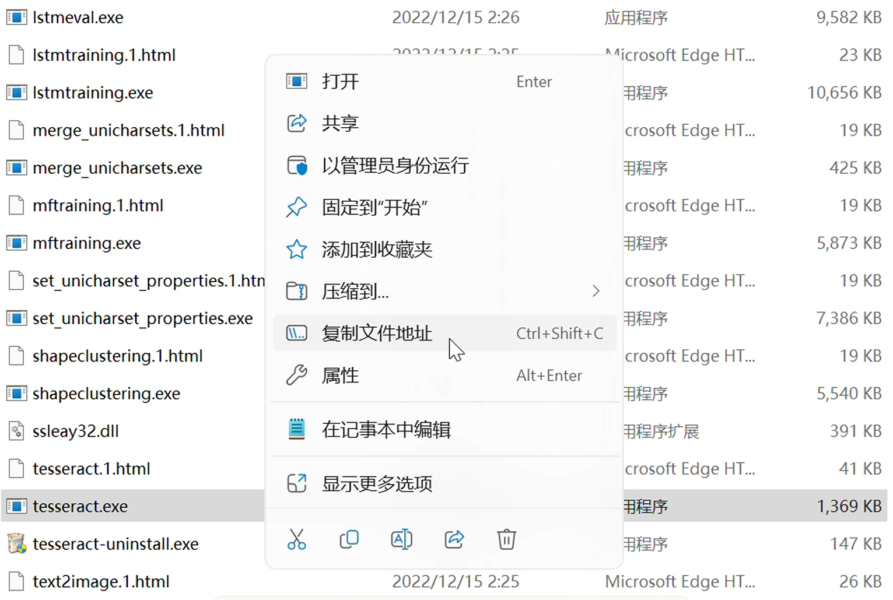

# 小猿口算20以内比大小自动脚本

## 准备工作
1. **截图软件**：选择一个能够截图的软件（如微信、QQ等），确保能够显示坐标。
2. **OCR软件**：安装 [Tesseract-OCR](https://digi.bib.uni-mannheim.de/tesseract/)。无需完成环境变量配置，只需完成安装即可。
3. **安卓模拟器**：选择并安装一个安卓模拟器。
4. **Python环境**：确保已安装并配置好Python。
5. **设备准备**：准备一双灵巧的双手。

## 安装依赖
在使用本脚本之前，请确保安装以下Python库：

```bash
pip install opencv-python keyboard numpy pyautogui pytesseract pillow
```

## 使用说明
1. 将安装好的Tesseract-OCR的 `tesseract.exe` 路径放到下载的Python文件的最前面。
   
  右键他，选择复制文件地址(Ctrl+Shift+C)来获得这个路径
   
2. 使用截图软件获取需要的几个坐标，并填写到下载的Python文件的前面。
   
   
   

3. 按下你的python编译器里面那个可爱的运行键。
4. 将安卓模拟器调整到全屏，放到前台，打开pk，按下空格。
5. 找一个舒服的姿势躺在床上，等待程序自动运行。

## 注意事项
- 确保所有软件和环境配置正确。
- 根据需要调整截图坐标，可以稍微大一点（但是不要把中间那个大大的“？”截进去），以提高识别准确性。

